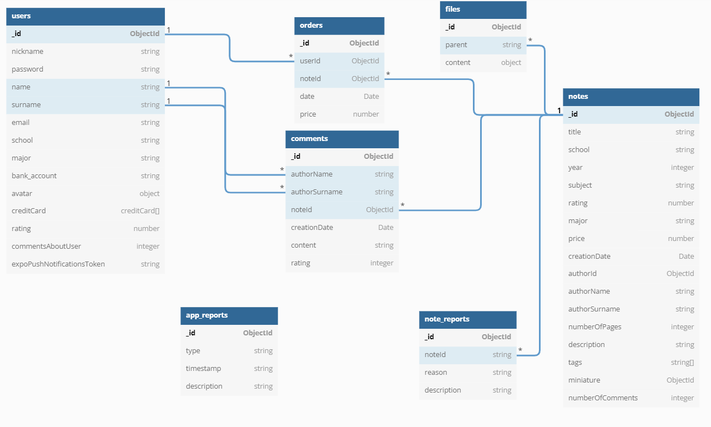

# Serwer backendowy do projektu "Note Dealer"


##### Zespół numer 2, 
##### Programowanie Zespołowe 2021/2022

***

## Spis treści
* [Opis działania](#opis-działania)
* [Wykorzystane technologie](#wykorzystane-technologie)
* [Architektura bazy danych](#architektura-bazy-danych)
* [Dokumentacja API](#dokumentacja-api)
* [Fragment kodu](#fragment-kodu)
* [Uruchamianie serwera](#uruchamianie-serwera)
* [Obsługa Heroku](#obsługa-heroku)

***

# Opis działania
Aplikacja frontendowa komunikuje się z serwerem za pomocą REST API wysyłając do niego zapytania, które są przez niego przetwarzane. Wysyła on następnie odpowiednie zapytanie do bazy danych, otrzymując odpowiedź, która po przetworzeniu jest przesyłana do aplikacji frontendowej w postaci obiektu JSON. 

# Wykorzystane technologie

Kod serwera napisany został w języku TypeScript.

* [MongoDB](https://www.mongodb.com/)
* [ExpressJS](https://expressjs.com/)
* [NodeJS](https://nodejs.org/en/)
* [Firebase](https://firebase.google.com/)
* [Heroku](https://www.heroku.com/)

### Wykorzystane biblioteki

W tworzeniu aplikacji pomogło użycie gotowych paczek:

* [Multer](https://www.npmjs.com/package/multer)
* [Bcrypt](https://www.npmjs.com/package/bcrypt)
* [NodeMailer](https://www.npmjs.com/package/nodemailer)

# Architektura bazy danych


* Users\
Odpowiada za konta użytkowników aplikacji

* Notes\
Odpowiada za dane notatek dostępnych w aplikacji

* Orders\
Odpowiada za transakcje związane z notatkami

* App_reports\
Odpowiada za zgłoszenia dotyczące błędów aplikacji

* Note_reports\
Odpowiada za zgłoszenia nieodpowiednich treści notatek

* Comments\
Odpowiada za komentarze notatek

* Files\
Odpowiada za pliki przesyłane przez użytkowników

# Dokumentacja API

* [Swagger](https://app.swaggerhub.com/apis-docs/NoteDealer/NoteDealer/1.0.0#/)

# Fragment kodu

```typescript
export const buyNote = async (
    userId: String,
    noteId: string,
    price: number,
    database: Db
) => {
    await database.collection("orders").insertOne({
        userId: userId,
        noteId: noteId,
        date: Date.now(),
        price: price,
    });

    let note = await database.collection("notes").findOne({_id: new ObjectId(noteId)}, {projection: {authorId: 1, title: 1}});
    
    if(note!=null){
        let authorToken = await getPushTokenOfUser(note.authorId, database);

        await fetch('https://exp.host/--/api/v2/push/send', {
            method: 'POST',
            headers: {
                'host': "exp.host",
                'accept': 'application/json',
                'accept-encoding': 'gzip, deflate',
                'content-type': 'application/json'
            },
            body: JSON.stringify({
                "to": authorToken,
                "title": "Ktoś kupił Twoją notatkę!",
                "body": "Notatka " + note.title + " została kupiona."
            })
        }).then((response) => {
            console.log(response.status);
            console.log(response.text);
        }).catch((error) => console.log(error));
    }
};
```
Przedstawiony fragment kodu odpowiada za realizację kupna notatki przez użytkownika, oraz wysłanie powiadomienia o kupnie do autora notatki.

# Uruchamianie serwera

Aby uruchomić server używamy komendy:
`yarn start`

Aby skompilować TypeScript na JavaScript:
`yarn tsc -p tsconfig.json`


# Obsługa Heroku

Budujemy aplikacje:
`yarn tsc -p tsconfig.json`

Dodajemy wszystkie pliki do repo:
`git add .`
`git commit -m "message"`

Pushujemy zmiany na heroku:
`git push heroku main`

Do sprawdzenia używamy komendy:
`heroku logs --tail`